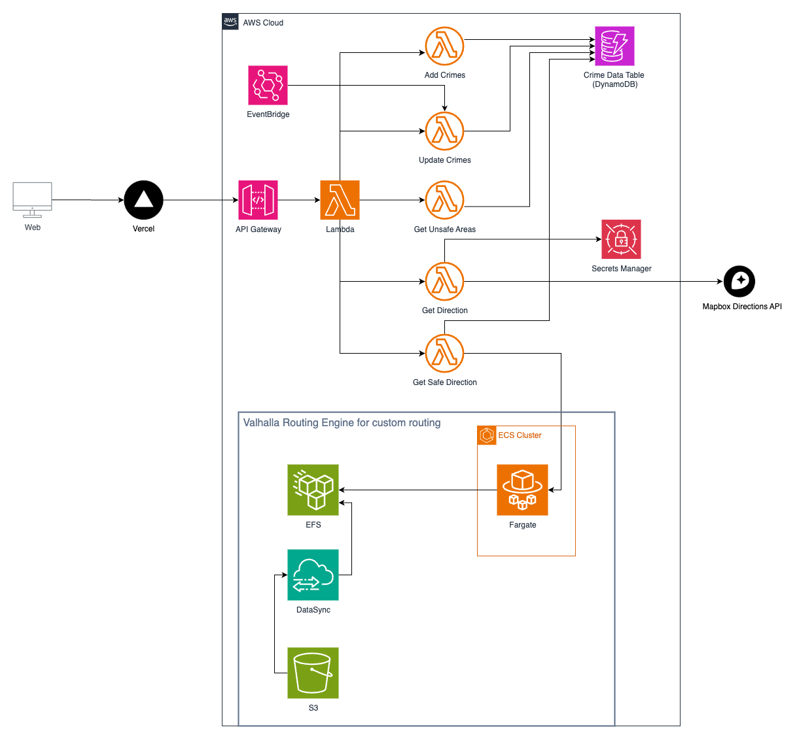

# Pathfinder
A crime-aware route planning system that helps users travel safely by avoiding high-crime areas. It uses Mapbox Directions API to get the fastest route and uses Valhalla Routing Engine with Toronto's crime data to get the safest route.

Also a learning project for me to play around with AWS services and IaC with Terraform.
## Demo
https://github.com/user-attachments/assets/9131beda-308d-45ee-97d7-58fdb7688685

## Architecture Diagram

## Room for improvements
### Features
- Add search bar to search for destionations with their information (like in Google Maps)
- Implement user search history

### Code & architecture
- Add load balancer so that we don't need to manually update the IP address of the ECS service when deploy new versions
- Create a custom image for Valhalla that also downloads the map data to prevent the need to manually sync map data from local machine to S3 bucket
- Make a GitHub Action workflow to automate Terraform deployment upon pushing to main branch
- Implement caching for API calls

## TODO
- Write documentation for future references

## Miscelaneous
- A local version of the project that was built with Vite and FastAPI for experimentation is available at [pathfinder-local](https://github.com/maiahg/pathfinder_local) (lowkey quick and dirty style)
- The deployment is no longer working as I needed to destroy the AWS services.
